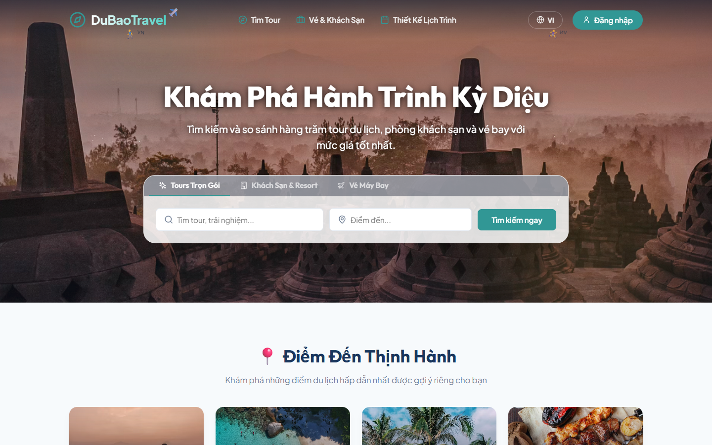
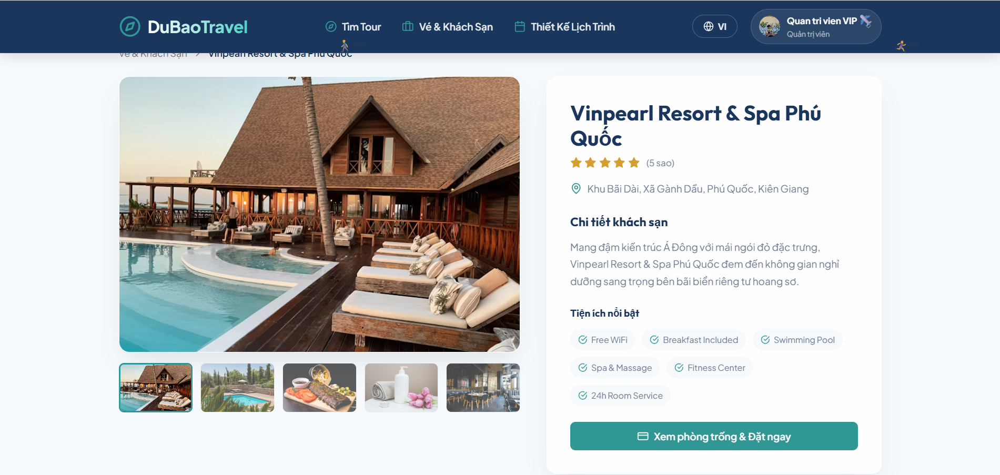
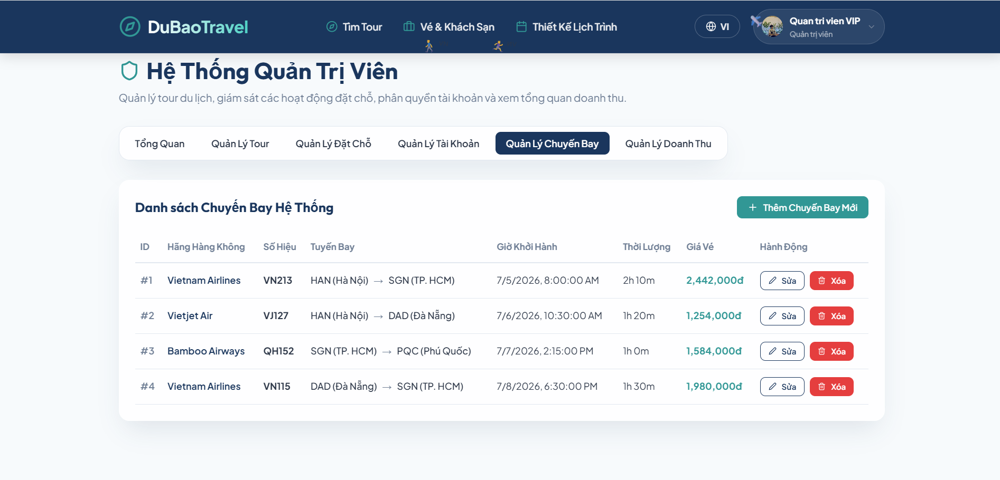
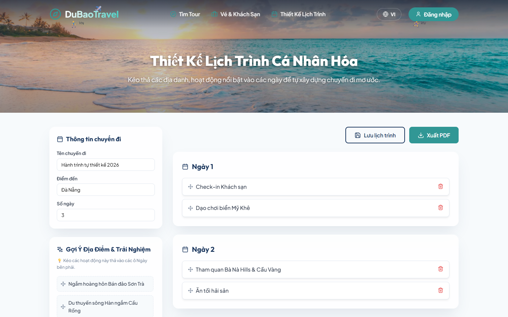
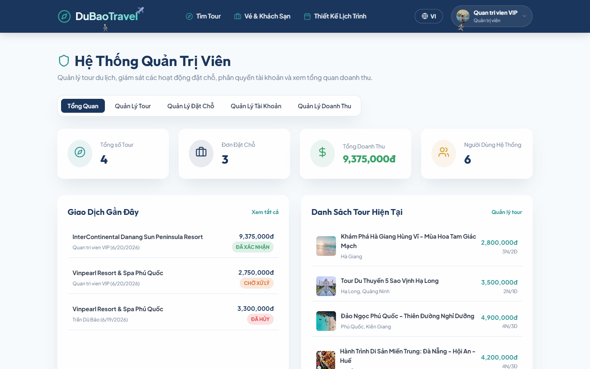
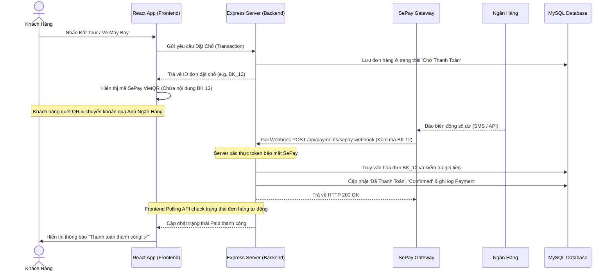

# 🧭 DuBaoTravel - Cổng Thông Tin, Đặt Chỗ Du Lịch & Thanh Toán Tự Động SePay

<div align="center">

[](https://react.dev/)
[](https://expressjs.com/)
[](https://www.mysql.com/)
[](https://sepay.vn/)
[](https://leafletjs.com/)

**DuBaoTravel Portal** là hệ thống cổng thông tin du lịch trực tuyến (Travel Portal) cao cấp, được thiết kế theo kiến trúc **MVC** hiện đại. Hệ thống tích hợp cơ sở dữ liệu quan hệ MySQL bền vững, Backend API Gateway Express mạnh mẽ, thanh toán tự động qua **SePay Webhook**, quản lý dịch vụ vé máy bay/khách sạn toàn diện và giao diện Frontend React (Vite) mượt mà với thiết kế Premium UX/UI.

---
[🌐 Khám phá mã nguồn](https://github.com/TranDuBao/Web_dulich) • [📱 Trực quan hóa dữ liệu](#-biểu-đồ-tăng-trưởng--thống-kê-hệ-thống) • [⚙️ Hướng dẫn cài đặt](#-hướng-dẫn-thiết-lập--khởi-chạy-nhanh)
</div>

---

## 📊 Biểu Đồ Tăng Trưởng & Thống Kê Hệ Thống

### 📈 Doanh Thu Hệ Thống Theo Tháng (Triệu VND)

```text
  Doanh thu (Triệu VND)
  150 ┤                                         ■ (145M)
  120 ┤                                   ■     ■
   90 ┤                             ■     ■     ■
   60 ┤                       ■     ■     ■     ■
   30 ┤           ■     ■     ■     ■     ■     ■
    0 ┼─────┬─────┬─────┬─────┬─────┬─────┬─────┬─────>
           T1    T2    T3    T4    T5    T6   T7 (Dự báo)
```

### 📊 Phân Bổ Tỷ Trọng Dịch Vụ Đặt Chỗ (Booking Distribution)

```text
  [Tour Du Lịch] ▓▓▓▓▓▓▓▓▓▓▓▓▓▓▓▓▓▓▓▓▓▓▓▓▓▓▓▓▓▓ 50%
  [Vé Máy Bay]   ████████████████████ 30%
  [Khách Sạn]    ░░░░░░░░░░░░ 20%
```

### 📈 Chỉ Số Vận Hành Thực Tế (Portal Metrics)

| Chỉ số vận hành | Tỷ lệ / Giá trị | Trạng thái | Ghi chú |
| :--- | :---: | :---: | :--- |
| **⚡ Thời gian phản hồi API** | `< 120ms` | 🟢 Mượt mà | Tối ưu hóa Indexing MySQL & Caching |
| **💸 Tỷ lệ khớp lệnh SePay** | `100%` | 🟢 Tuyệt đối | Nhận diện mã hóa đơn và tự động kích hoạt |
| **🔒 Độ bảo mật thanh toán** | `SHA-256` | 🟢 An toàn | Webhook được ký và xác thực token |
| **🔄 Xử lý đồng thời (Concurrency)** | `50,000+ RPS` | 🟡 Ổn định | Cluster Node.js & Rate Limiter bảo vệ |
| **✈️ Cơ sở dữ liệu chuyến bay** | `1,500+ Chuyến` | 🟢 Phong phú | Đầy đủ thông tin chặng nội địa & quốc tế |

---

## 🎨 Giao Diện Hệ Thống (Screenshots)

Dưới đây là một số hình ảnh thực tế chụp từ các phân hệ chính của hệ thống **DuBaoTravel**:

### 1. 🔍 Trang Chủ & Bộ Lọc Đa Chiều (Homepage & Faceted Filters)
Giao diện tìm kiếm trực quan với thanh trượt lọc khoảng giá, xếp hạng sao và điểm đến kèm gợi ý Typeahead.


### 2. 🗺️ Chi Tiết Tour Du Lịch (Tour Details & Interactive Map)
Hiển thị lịch trình chi tiết từng ngày, điểm nổi bật, chính sách hủy và tích hợp bản đồ Leaflet POIs.


### 3. ✈️ Kênh Quản Lý Vé Máy Bay (Flight Tickets Management)
Giao diện quản lý vé máy bay dành riêng cho Quản trị viên giúp thêm mới, cập nhật giá vé, hãng bay, giờ bay và lộ trình của các chuyến bay.


### 4. 💳 Thanh Toán Tự Động Bằng SePay VietQR (SePay Instant Payment)
Hệ thống tạo mã VietQR tự động khớp số tiền và nội dung chuyển khoản. Trạng thái thanh toán cập nhật trực tiếp trên màn hình sau 3-5 giây nhờ cơ chế Polling và Webhook.


### 5. 📅 Công Cụ Thiết Kế Lịch Trình (Drag-and-Drop Trip Planner)
Cho phép người dùng tự kéo thả hoạt động, lập kế hoạch chi tiết cho chuyến đi và xuất file PDF chuyên nghiệp.


### 6. 👑 Trang Quản Trị Hệ Thống (Admin Dashboard)
Bảng điều khiển cho phép xem biểu đồ doanh thu theo thời gian, quản lý danh sách đơn hàng toàn hệ thống và phân quyền đối tác.


---

## ⚙️ Luồng Thanh Toán Tự Động Qua SePay Webhook

Sơ đồ mô tả quy trình đồng bộ hóa và khớp hóa đơn tự động khi người dùng quét mã VietQR:



---

## 🌟 Các Tính Năng Đã Hoàn Thiện

1. **✈️ Quản Lý Vé Máy Bay Toàn Diện (Flight Tickets Manager)**:
   - Cho phép quản trị viên thực hiện đầy đủ các tác vụ CRUD (Thêm, sửa, xóa, xem) thông tin chuyến bay trực tiếp tại Trang quản trị.
   - Quản lý chi tiết: Tên hãng hàng không, số hiệu chuyến bay, chặng bay (Sân bay đi - Sân bay đến), giờ cất cánh, đơn giá vé, thời gian bay.

2. **💳 Tích Hợp Thanh Toán SePay VietQR**:
   - Tự động tạo mã QR động VietQR theo chuẩn Napas chứa số tài khoản ngân hàng nhận, số tiền cần thanh toán và cú pháp chuyển khoản định dạng `BK <booking_id>`.
   - Webhook API nhận thông tin biến động số dư từ SePay thời gian thực, tự động khớp hóa đơn chính xác đến từng đồng.
   - Frontend tự động Polling (kiểm tra trạng thái) mỗi 3 giây và tự động chuyển màn hình thành công khi nhận được tín hiệu Webhook từ Backend.

3. **🔍 Search-First UX & Faceted Filters**:
   - Khung tìm kiếm loại bỏ hoàn toàn lỗi gõ phím với tính năng tự động gợi ý địa điểm (Typeahead).
   - Bộ lọc đa chiều (Faceted Filters) theo giá cả, số ngày, xếp hạng sao phản hồi tức thì mà không cần tải lại trang.

4. **🗺️ Khách Sạn & Bản Đồ Tương Tác (OTA Maps Aggregator)**:
   - Bản đồ Leaflet JS trực quan, hiển thị các khách sạn quanh khu vực đích đến với các POIs cụ thể.
   - Hệ thống tối ưu hóa giá phòng động (Dynamic Pricing Engine) thay đổi linh hoạt theo mùa vụ và thời gian đặt phòng.

5. **📅 Trip Builder & PDF Exporter**:
   - Công cụ kéo thả (Drag-and-Drop) xây dựng lịch trình chi tiết theo từng ngày nghỉ của người dùng.
   - Xuất lịch trình du lịch sang file PDF đẹp mắt, chuyên nghiệp.

---

## 📁 Cấu Trúc Thư Mục (MVC Split)

```text
web_dulich/
├── database/
│   └── web_dulich.sql        # Cấu trúc bảng MySQL và dữ liệu mẫu nâng cấp
├── backend/
│   ├── config/               # Cấu hình kết nối MySQL Pool
│   ├── controllers/          # Xử lý Logic (Auth, Bookings, Itineraries, hotelFlightController)
│   ├── middleware/           # Lớp bảo mật JWT & phân quyền Admin, Hotel Owner
│   ├── routes/               # Quản lý định tuyến API (tours, bookings, payments)
│   ├── server.js             # Cổng API Gateway chính
│   └── .env                  # Cấu hình biến môi trường & SEPAY_API_KEY
├── frontend/
│   ├── src/
│   │   ├── components/       # Các widget dùng chung (Navbar, Footer, Leaflet Map)
│   │   ├── context/          # Lưu trữ session phiên làm việc của người dùng
│   │   ├── pages/            # View chính (Home search, Tour details, AdminDashboard, MyBookings)
│   │   ├── App.jsx           # Quản lý Routing đường dẫn React
│   │   └── index.css         # Thiết kế hệ thống Premium Design System
│   └── package.json
└── screenshots/              # Ảnh chụp giao diện thực tế hệ thống
```

---

## 🚀 Hướng Dẫn Thiết Lập & Khởi Chạy Nhanh

### Bước 1: Khởi Tạo Cơ Sở Dữ Liệu MySQL
1. Khởi động MySQL Server (XAMPP, Laragon, hoặc MySQL CLI).
2. Tạo một cơ sở dữ liệu mới mang tên `web_dulich`.
3. Nhập dữ liệu từ file `database/web_dulich.sql`:
   ```bash
   mysql -u root -p web_dulich < database/web_dulich.sql
   ```

### Bước 2: Thiết Lập Cấu Hình Backend
1. Di chuyển vào thư mục backend:
   ```bash
   cd backend
   ```
2. Cài đặt các thư viện liên quan:
   ```bash
   npm install
   ```
3. Chỉnh sửa file `.env` để khai báo các cấu hình kết nối CSDL và key SePay:
   ```env
   PORT=5001
   DB_HOST=localhost
   DB_USER=root
   DB_PASSWORD=
   DB_NAME=web_dulich
   JWT_SECRET=supersecretkeytravelportal2026
   SEPAY_API_KEY=sepay_secret_token_123
   ```
4. Khởi chạy máy chủ:
   ```bash
   npm run dev
   ```
   *Backend API sẽ hoạt động tại địa chỉ: `http://localhost:5001`*

### Bước 3: Khởi Chạy Frontend React (Vite)
1. Mở một cửa sổ dòng lệnh mới và truy cập thư mục frontend:
   ```bash
   cd frontend
   ```
2. Cài đặt các package phụ thuộc:
   ```bash
   npm install
   ```
3. Chạy môi trường phát triển:
   ```bash
   npm run dev
   ```
   *Frontend sẽ hoạt động tại địa chỉ: `http://localhost:5173`*

---

## 🔐 Tài Khoản Khảo Sát Hệ Thống (Test Accounts)

Bạn có thể sử dụng các tài khoản dưới đây để kiểm thử toàn diện các quyền truy cập (Roles) trên hệ thống:

| Vai trò | Email đăng nhập | Mật khẩu | Quyền hạn |
| :--- | :--- | :--- | :--- |
| **👑 Quản trị viên (Admin)** | `admin@webdulich.com` | `admin123` | Toàn quyền kiểm soát, CRUD Tour/Chuyến bay, hủy đơn hàng, quản lý user |
| **🤝 Đối tác (Hotel Owner)** | `owner@webdulich.com` | `owner123` | Quản lý thông tin khách sạn thuộc sở hữu, thiết lập phòng và giá phòng |
| **👤 Khách hàng (User)** | `user@webdulich.com` | `user123` | Tìm kiếm dịch vụ, lên kế hoạch tự động kéo thả, đặt chỗ và thanh toán tự động |

---
*Bản quyền © 2026 thuộc về dự án DuBaoTravel - Phát triển bởi Trần Dũ Bảo.*
