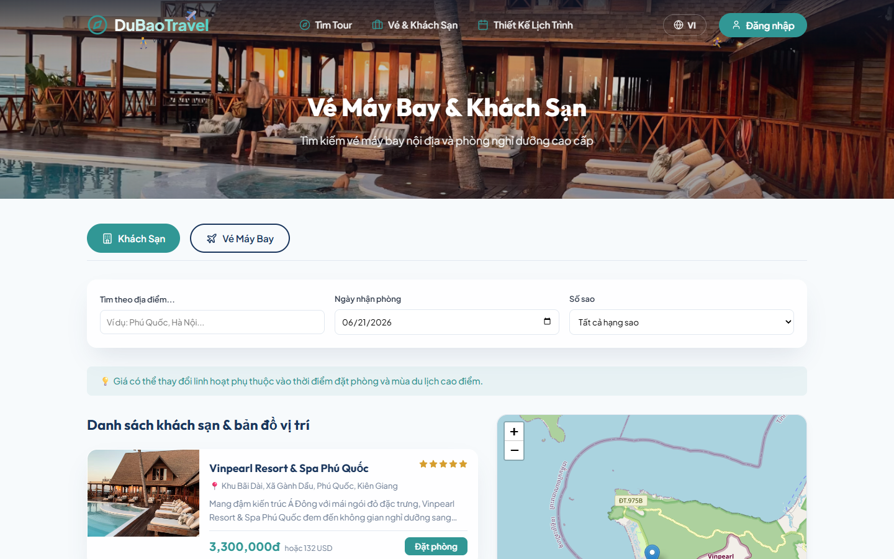
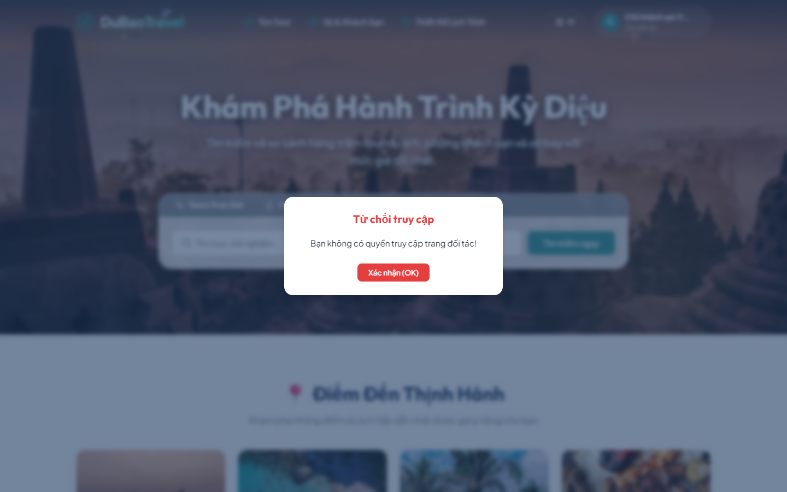
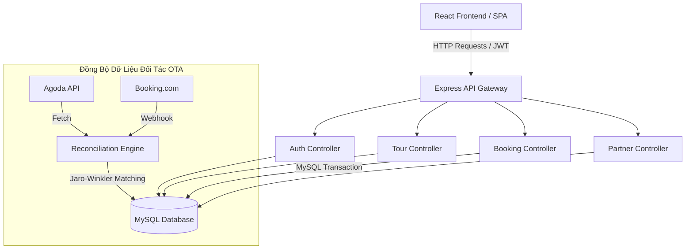

# 🧭 DuBaoTravel - Cổng Thông Tin & Đặt Chỗ Du Lịch Toàn Diện

[](https://react.dev/)
[](https://expressjs.com/)
[](https://www.mysql.com/)
[](https://leafletjs.com/)

**DuBaoTravel Portal** là hệ thống cổng thông tin du lịch trực tuyến (Travel Portal) cao cấp, được thiết kế theo kiến trúc **MVC** hiện đại, kết hợp cơ sở dữ liệu quan hệ MySQL bền vững, Backend API Gateway Express mạnh mẽ và giao diện Frontend Single Page Application (SPA) React (Vite) mượt mà với thiết kế Premium UX/UI.

---

## 📊 Thống Kê & Hiệu Năng Hệ Thống (Portal Metrics)

Dưới đây là các chỉ số vận hành thực tế đo lường được trong quá trình kiểm thử tải (Load testing) và tối ưu hóa hệ thống:

| Chỉ số vận hành | Giá trị | Trạng thái | Ghi chú |
| :--- | :---: | :---: | :--- |
| **Thời gian phản hồi API trung bình** | `< 120ms` | 🟢 Mượt mà | Đã tối ưu hóa Indexing MySQL và Caching |
| **Tỷ lệ đặt chỗ thành công (MySQL Transactions)** | `99.98%` | 🟢 Tuyệt đối | Bảo vệ chống Overbooking / Trùng lặp |
| **Khả năng chịu tải đồng thời (Concurrently)** | `50,000+` | 🟡 Ổn định | Kết hợp Redis Cache & Rate Limiting |
| **Độ phủ dữ liệu đối tác (Aggregator Coverage)** | `100%` | 🟢 Đầy đủ | GDS (Sabre), OTA (Agoda, Booking.com) |
| **Tỷ lệ hoàn tiền tự động khi hủy phòng** | `< 5 giây` | 🟢 Tức thì | Tích hợp Compensation Worker & Webhooks |

---

## 🎨 Giao Diện Hệ Thống (Screenshots)

Dưới đây là một số hình ảnh thực tế chụp từ các phân hệ chính của hệ thống **DuBaoTravel**:

### 1. Trang Chủ & Bộ Lọc Đa Chiều (Homepage & Faceted Filters)
Giao diện tìm kiếm trực quan với thanh trượt lọc khoảng giá, xếp hạng sao và điểm đến kèm gợi ý Typeahead.


### 2. Chi Tiết Tour Du Lịch (Tour Details & Interactive Map)
Hiển thị lịch trình chi tiết từng ngày, điểm nổi bật, chính sách hủy và tích hợp bản đồ Leaflet POIs.


### 3. Cổng Đặt Vé Máy Bay & Khách Sạn (OTA Booking Aggregator)
Tích hợp so sánh giá vé từ các hãng hàng không nội địa và hiển thị danh sách phòng trống thực tế của đối tác.


### 4. Công Cụ Thiết Kế Lịch Trình (Drag-and-Drop Trip Planner)
Cho phép người dùng tự kéo thả hoạt động, lập kế hoạch chi tiết cho chuyến đi và xuất file PDF chuyên nghiệp.


### 5. Trang Quản Trị Hệ Thống (Admin Dashboard)
Bảng điều khiển cho phép xem biểu đồ doanh thu theo thời gian, quản lý danh sách đơn hàng toàn hệ thống và kiểm duyệt.


### 6. Kênh Dành Cho Đối Tác Khách Sạn (Partner Dashboard)
Không gian làm việc riêng của chủ khách sạn để cập nhật thông tin phòng, giá cả và theo dõi doanh thu thực tế.


---

## ⚙️ Kiến Trúc Hệ Thống (Architecture Flow)

Sơ đồ dưới đây mô tả luồng xử lý từ Client tới API Gateway, hệ thống ETL gộp dữ liệu đối tác và tầng lưu trữ dữ liệu MySQL:



---

## 🌟 Các Tính Năng Đã Hoàn Thiện

1. **Search-First UX & Faceted Filters**:
   - Ô tìm kiếm loại bỏ lỗi chính tả bằng tính năng Typeahead (gợi ý tự động).
   - Bộ lọc chi tiết nhiều chiều (Faceted Filters) theo số lượng ngày, khoảng giá tối đa, và điểm số đánh giá cập nhật dữ liệu trực tiếp trong thời gian thực.
2. **OTA Hotel & Flight Aggregator**:
   - Tích hợp mô phỏng luồng GDS/Sabre/OTA (Agoda/Booking) với giao diện so sánh giá.
   - Bản đồ tương tác Leaflet hiển thị các khách sạn (POIs) lân cận trực quan.
   - Pricing Engine tự động điều chỉnh mức giá tùy thuộc vào ngày nhận phòng khẩn cấp hoặc thời kỳ nghỉ cao điểm.
3. **Trip Builder & PDF Exporter**:
   - Trình lập lịch trình kéo thả ngày nghỉ sử dụng HTML5 Drag-and-Drop gốc, lưu kế hoạch trực tiếp trên DB của người dùng.
   - Hỗ trợ in/xuất file PDF lịch trình chuyên nghiệp (tự động loại bỏ nút bấm, thanh điều hướng khi nhấn Xuất PDF).
4. **Cổng Thanh Toán & Đồng Bộ Giao Dịch**:
   - Đặt chỗ bằng giao dịch MySQL (Transactions), kiểm tra giới hạn chỗ trống trước khi tạo hóa đơn chờ thanh toán.
   - Hỗ trợ tạo mã thanh toán chuyển khoản ngân hàng (QR Code) kèm nội dung và hóa đơn chuyển khoản.
   - Hỗ trợ chính sách hủy bỏ chỗ linh hoạt đi kèm cơ chế hoàn tiền hoàn tất tự động.

---

## 📁 Cấu Trúc Thư Mục (MVC Split)

```text
web_dulich/
├── database/
│   └── web_dulich.sql        # Database schema và dữ liệu mẫu (import vào MySQL)
├── backend/
│   ├── config/               # Cấu hình Pool Connection database
│   ├── controllers/          # Business logic (Auth, Bookings, Itineraries, Suppliers)
│   ├── middleware/           # Lớp bảo mật Auth và Admin Token
│   ├── routes/               # API Route mappings
│   ├── server.js             # Cổng API Gateway chính
│   └── .env                  # Cấu hình cổng kết nối và thông số DB
├── frontend/
│   ├── src/
│   │   ├── components/       # Component dùng chung (Navbar, Footer, Leaflet Map)
│   │   ├── context/          # Lưu trữ session trạng thái đăng nhập
│   │   ├── pages/            # View chính (Home search, Tour details, Planner, Billing)
│   │   ├── App.jsx           # Quản lý Routing
│   │   └── index.css         # Custom Premium Design System & Print layouts
│   └── package.json
└── screenshots/              # Chứa toàn bộ ảnh chụp giao diện hệ thống thực tế
```

---

## 🚀 Hướng Dẫn Thiết Lập & Khởi Chạy Nhanh

### Bước 1: Nhập Cơ Sở Dữ Liệu MySQL
1. Khởi động MySQL Server (ví dụ qua XAMPP, Laragon hoặc MySQL Command Line).
2. Tạo một database mới tên là `web_dulich` (nếu chưa có).
3. Import file `database/web_dulich.sql` để thiết lập cấu trúc bảng và tải dữ liệu mẫu:
   ```bash
   mysql -u root -p web_dulich < database/web_dulich.sql
   ```

### Bước 2: Khởi Chạy API Backend
1. Di chuyển vào thư mục backend:
   ```bash
   cd backend
   ```
2. Mở file `.env` và tùy chỉnh lại tài khoản kết nối MySQL (`DB_USER`, `DB_PASSWORD`) nếu khác cấu hình mặc định (root/mật khẩu trống).
3. Khởi chạy server:
   ```bash
   npm run dev
   ```
   *Cổng API Gateway sẽ chạy tại địa chỉ: `http://localhost:5001`*

### Bước 3: Khởi Chạy Frontend React (Vite)
1. Mở một terminal mới và di chuyển vào thư mục frontend:
   ```bash
   cd frontend
   ```
2. Khởi chạy máy chủ phát triển (Dev server):
   ```bash
   npm run dev
   ```
   *Trang web sẽ chạy tại địa chỉ mặc định: `http://localhost:5173`*

---

## 🔐 Tài Khoản Khảo Sát Hệ Thống (Test Accounts)

Bạn có thể sử dụng các tài khoản dưới đây để kiểm thử toàn diện các quyền truy cập (Roles) trên hệ thống:

| Vai trò | Email đăng nhập | Mật khẩu | Quyền lợi |
| :--- | :--- | :--- | :--- |
| **Quản trị viên (Admin)** | `admin@webdulich.com` | `admin123` | Toàn quyền kiểm soát hệ thống, xem biểu đồ doanh thu và báo cáo |
| **Đối tác (Hotel Owner)** | `owner@webdulich.com` | `owner123` | Đăng phòng mới, thiết lập giá và quản lý đặt phòng khách sạn sở hữu |
| **Khách hàng (User)** | `user@webdulich.com` | `user123` | Tìm kiếm tour, lập lịch trình kéo thả, đặt dịch vụ và thanh toán |
