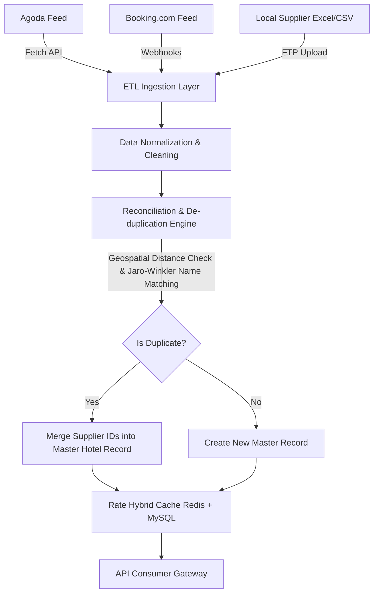

# VinaTravel Portal - Tài Liệu Kỹ Thuật & Hướng Dẫn Vận Hành

Tài liệu này cung cấp chi tiết về kiến trúc API Gateway, thiết kế đường ống ETL chuẩn hóa dữ liệu nhà cung cấp, và cẩm nang vận hành (Runbook) cho mùa cao điểm.

---

## 1. API Gateway Specifications (OpenAPI format)

Cổng API Gateway tổng hợp dịch vụ từ các hệ thống GDS, OTA và các nhà cung cấp nội địa.

```yaml
openapi: 3.0.3
info:
  title: VinaTravel API Gateway
  description: API Gateway cho cổng thông tin du lịch tích hợp OTA và nhà cung cấp địa phương.
  version: 1.0.0
servers:
  - url: http://localhost:5000/api
paths:
  /auth/register:
    post:
      summary: Đăng ký thành viên mới
      requestBody:
        required: true
        content:
          application/json:
            schema:
              type: object
              required: [name, email, password]
              properties:
                name: { type: string }
                email: { type: string }
                password: { type: string }
                phone: { type: string }
      responses:
        201:
          description: Tạo tài khoản thành công, trả về JWT Token.

  /auth/login:
    post:
      summary: Đăng nhập hệ thống
      requestBody:
        required: true
        content:
          application/json:
            schema:
              type: object
              required: [email, password]
              properties:
                email: { type: string }
                password: { type: string }
      responses:
        200:
          description: Đăng nhập thành công, trả về JWT Token.

  /tours:
    get:
      summary: Tìm kiếm & so sánh các gói tour
      parameters:
        - name: search
          in: query
          schema: { type: string }
        - name: destination
          in: query
          schema: { type: string }
        - name: duration
          in: query
          schema: { type: string, enum: [short, medium, long] }
        - name: maxPrice
          in: query
          schema: { type: number }
        - name: rating
          in: query
          schema: { type: number }
      responses:
        200:
          description: Trả về danh sách tour khớp bộ lọc.

  /suppliers/hotels:
    get:
      summary: Tìm kiếm phòng khách sạn với công cụ định giá động
      parameters:
        - name: location
          in: query
          schema: { type: string }
        - name: stars
          in: query
          schema: { type: integer }
        - name: checkInDate
          in: query
          schema: { type: string, format: date }
      responses:
        200:
          description: Trả về danh sách phòng khách sạn kèm quy đổi USD và giá động theo mùa vụ.

  /bookings:
    post:
      summary: Tạo mới đơn đặt chỗ (Tour, Khách sạn, Chuyến bay)
      security:
        - BearerAuth: []
      requestBody:
        required: true
        content:
          application/json:
            schema:
              type: object
              required: [type, referenceId, totalPrice]
              properties:
                type: { type: string, enum: [tour, hotel, flight] }
                referenceId: { type: integer }
                totalPrice: { type: number }
                guestDetails: { type: object }
      responses:
        201:
          description: Tạo đơn hàng thành công (Trạng thái Pending).
        400:
          description: Hết chỗ / Phòng trống (Inventory Check Fail).

  /bookings/pay:
    post:
      summary: Xác nhận thanh toán qua cổng thanh toán
      security:
        - BearerAuth: []
      requestBody:
        required: true
        content:
          application/json:
            schema:
              type: object
              required: [bookingId]
              properties:
                bookingId: { type: integer }
                paymentMethod: { type: string }
      responses:
        200:
          description: Giao dịch thành công, xác nhận đơn hàng thành công.
```

---

## 2. Mapping & ETL Pipeline (Supplier Inventory Reconciliation)

Để đồng bộ dữ liệu từ các nhà cung cấp OTA khác nhau (Agoda, Booking.com, Traveloka, GDS Sabre...) và tránh trùng lặp khách sạn / phòng (Duplicate properties), chúng tôi thiết lập đường ống ETL tự động.



### Quy Trình Xử Lý Eventual Consistency & Cache Invalidation:
1. **Normalizer Pipeline**: Chuẩn hóa toàn bộ cấu trúc dữ liệu về dạng chuẩn chung của VinaTravel (Tên, Tọa độ Lat/Lng, Tiện ích, Số sao).
2. **De-duplication**: Sử dụng thuật toán địa lý (Bán kính < 50m) kết hợp so khớp chuỗi (Jaro-Winkler) trên tên thực thể để gộp các bản ghi khách sạn trùng lặp từ nhiều nhà cung cấp khác nhau thành một Master ID duy nhất.
3. **Dynamic Inventory Sync**: 
   - Số lượng phòng trống được cache tại Redis với TTL ngắn (10-15 phút) trong giờ cao điểm.
   - Khi tiến hành thanh toán, hệ thống thực hiện một lượt kiểm tra trực tiếp (Real-time availability call) tới API của OTA/Nhà cung cấp để đảm bảo không bị Overbooking trước khi trừ tiền tài khoản khách hàng.

---

## 3. Runbook Cho Mùa Cao Điểm (Peak Season Operations)

Mùa hè và kỳ nghỉ lễ Tết thường chứng kiến lượng truy cập tăng vọt từ 10x - 50x so với ngày thường. Quy trình dưới đây đảm bảo hệ thống không bị sập (Downtime).

### A. Hệ thống Caching & Cổng bảo vệ (Rate Limiting)
*   **Edge Caching (CDN)**: Cấu hình Cloudflare/Cloudfront lưu trữ tĩnh toàn bộ hình ảnh phòng khách sạn, tour du lịch.
*   **Redis Caching cho Pricing Engine**: Giá phòng khách sạn và vé máy bay được tính toán động (Dynamic Pricing) dựa trên ngày đặt và độ khẩn cấp. Kết quả được lưu tại Redis với cơ chế tự hủy (Invalidation) ngay khi nhà cung cấp cập nhật giá sàn mới.
*   **API Rate Limiting**: Triển khai `express-rate-limit` hoặc Cloudflare WAF giới hạn tối đa 60 requests/phút đối với mỗi IP ở trang tìm kiếm để ngăn chặn crawlers cào dữ liệu làm sập luồng API.

### B. Circuit Breaker (Cầu chì phòng vệ đối tác sập)
*   Tích hợp thư viện Circuit Breaker (như `Opossum` trong NodeJS) cho các cổng API bên thứ ba (Sabre GDS, Agoda).
*   Khi tỷ lệ lỗi API của Agoda vượt quá 50% trong vòng 10 giây, cầu chì sẽ tự động **Mở (Open)**, ngay lập tức trả về dữ liệu lưu đệm cũ (Cached fallback) hoặc chuyển hướng sang kết nối với Booking.com, thay vì bắt khách hàng đợi timeout lâu dẫn đến nghẽn cổng kết nối hệ thống.

### C. Cơ chế Transactions & Compensation (Đặt chỗ / Hoàn tiền)
*   Hệ thống áp dụng kiến trúc giao dịch hai pha (Two-phase commits). Khi người dùng nhấn nút Đặt:
    1.  **Phase 1**: Hệ thống tạo một bản ghi Đơn hàng với trạng thái `Pending` và khóa chỗ trống (Lock inventory).
    2.  **Phase 2**: Thực hiện thanh toán. Nếu thanh toán thành công qua QR/Thẻ ngân hàng, cập nhật đơn hàng thành `Confirmed`.
*   **Compensation Logic (Hành động bù đắp)**: Nếu giao dịch thanh toán thất bại hoặc nhà cung cấp API đột ngột báo hết chỗ ở bước cuối cùng, hệ thống tự động khởi chạy Worker hoàn trả tiền (Refund/Pre-authorization release) thông qua webhook của cổng thanh toán và mở lại chỗ trống trong database.

### D. Giám sát & Đo lường (Observability)
*   Sử dụng Prometheus và Grafana để giám sát tỷ lệ đặt hàng thành công (Booking Success Rate).
*   Thiết lập cảnh báo tự động qua Slack/Telegram nếu tỷ lệ đơn hàng lỗi tăng quá 5% trong vòng 5 phút.
